# ⚽ Mundial Qatar 2022 App

Aplicación móvil desarrollada en **Flutter** que brinda información completa sobre la **Copa Mundial de Fútbol Qatar 2022**. La app presenta detalles de partidos, grupos, selecciones, jugadores y estadios, todo con una interfaz moderna inspirada en la identidad visual oficial del mundial.

## 📋 Descripción

Esta aplicación permite a los aficionados del fútbol tener acceso a toda la información del Mundial Qatar 2022 en un solo lugar. Desde el fixture de partidos organizados por fecha, hasta información detallada de cada jugador destacado, pasando por las características de los impresionantes estadios construidos para el evento.

## ✨ Funcionalidades

| Módulo | Descripción |
| --- | --- |
| **Pantallas de Bienvenida** | Onboarding con presentación de la app mediante slides informativos |
| **Autenticación** | Login, registro de usuarios y recuperación de contraseña |
| **Home Principal** | Navegación con categorías: Recomendado, Estadios, Grupos, Jugadores, Partidos del día |
| **Fixture de Partidos** | Calendario de encuentros organizado por fechas (20-24 Nov, etc.) |
| **Detalle de Partidos** | Información de cada encuentro: equipos, hora, estadio |
| **Grupos y Selecciones** | Visualización de los 8 grupos con las selecciones participantes |
| **Listado de Selecciones** | Todas las selecciones con sus banderas e información |
| **Detalle de Selección** | Información completa de cada selección |
| **Jugadores Destacados** | Galería de jugadores top con fotos y biografías |
| **Detalle de Jugadores** | Perfil completo: nombre, descripción, galería de imágenes |
| **Estadios** | Los 8 estadios del mundial con capacidad y ubicación |
| **Detalle de Estadios** | Información arquitectónica y características de cada estadio |
| **Perfil de Usuario** | Sección de configuración y datos del usuario |
| **Favoritos** | Guardar selecciones o jugadores favoritos |

## 📱 Capturas de Pantalla

### Pantallas de Presentación (Splash/Onboarding)

| Splash 1 | Splash 2 | Splash 3 |
|:---:|:---:|:---:|
| 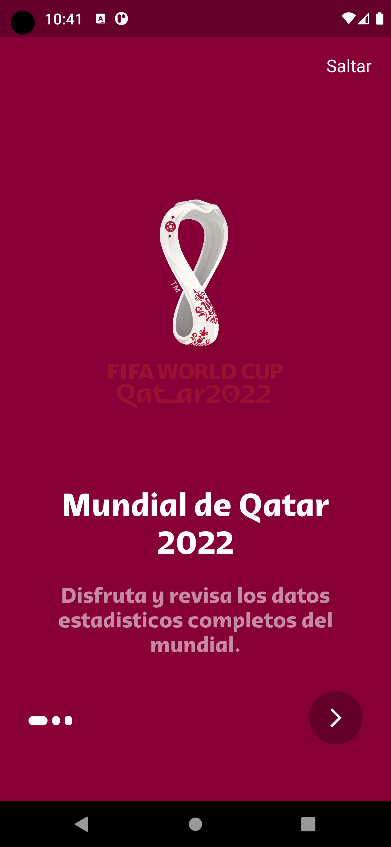 | 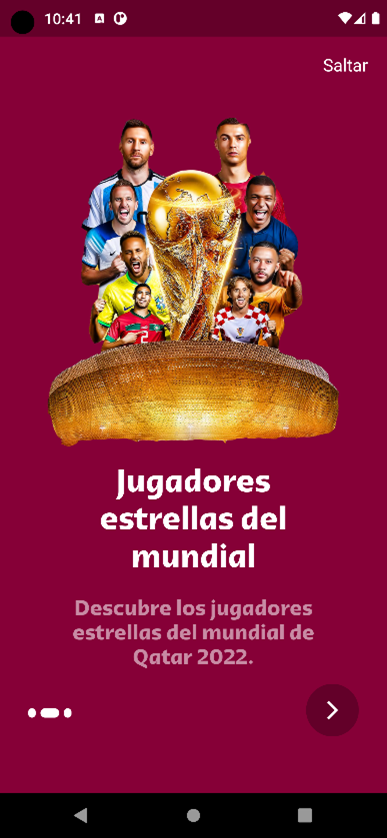 | 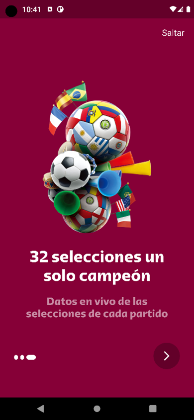 |

### Autenticación

| Login | Registro |
|:---:|:---:|
|  |  |

### Pantalla Principal (Home)

| Home 1 | Home 2 | Home 3 |
|:---:|:---:|:---:|
| 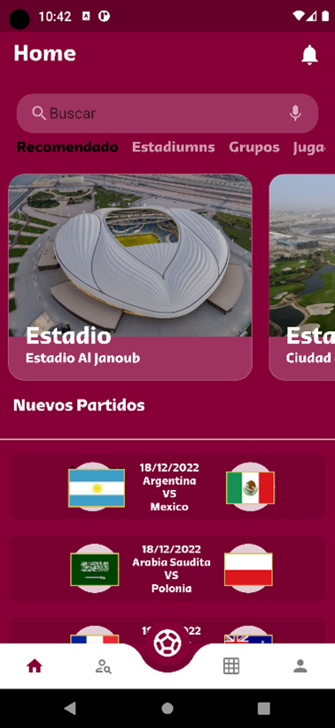 | 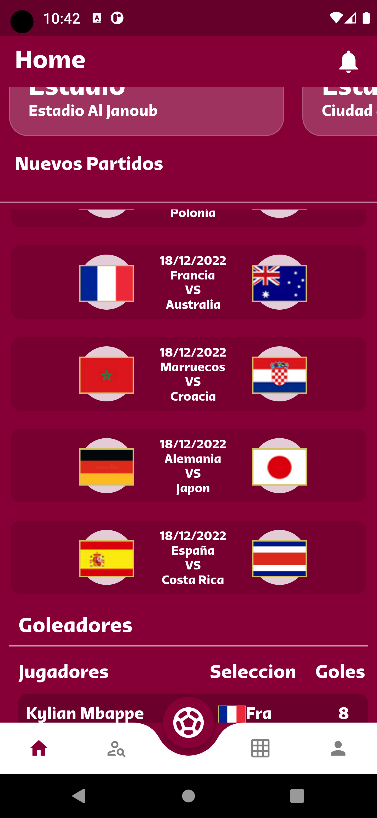 | 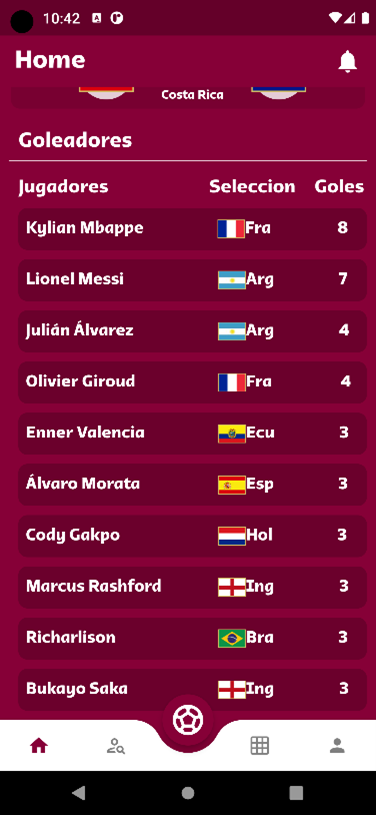 |

### Partidos y Fixture

| Calendario de Partidos | Detalle del Partido |
|:---:|:---:|
| 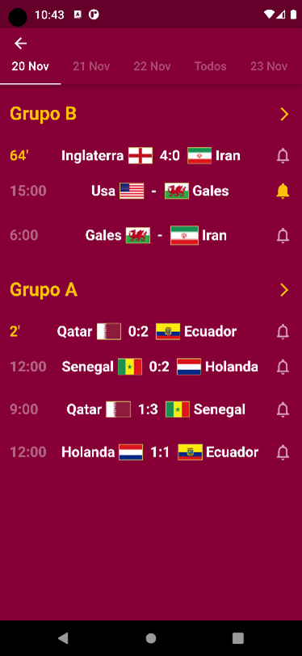 | 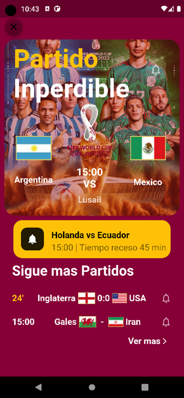 |

### Grupos y Selecciones

| Grupos | Lista de Selecciones | Detalle de Selección |
|:---:|:---:|:---:|
| 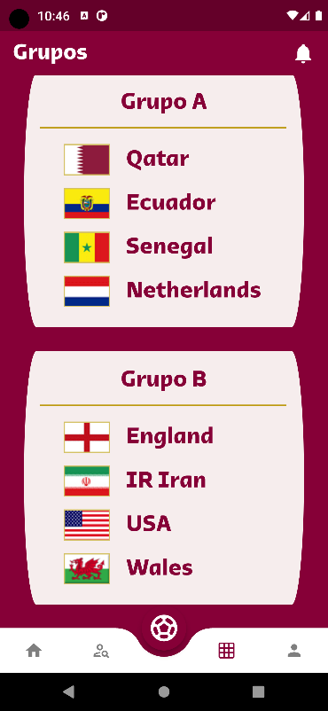 | 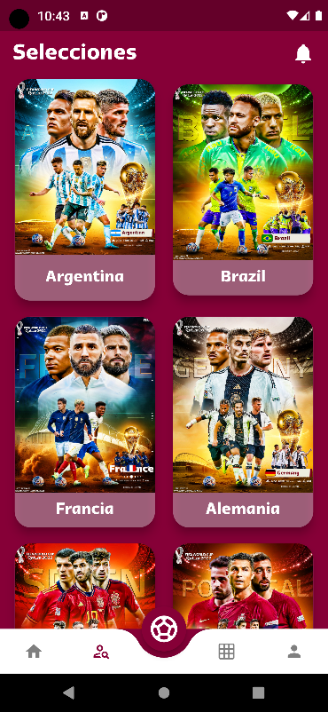 | 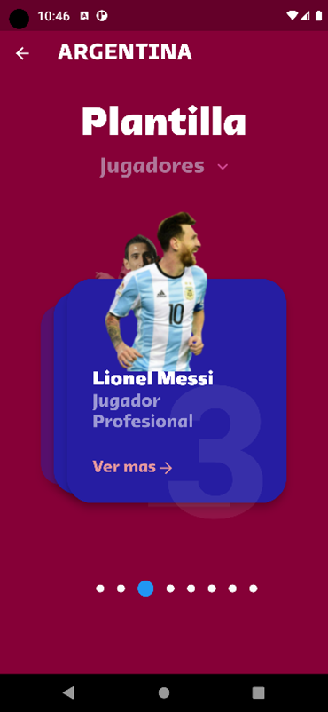 |

### Estadios

| Detalle del Estadio |
|:---:|
| 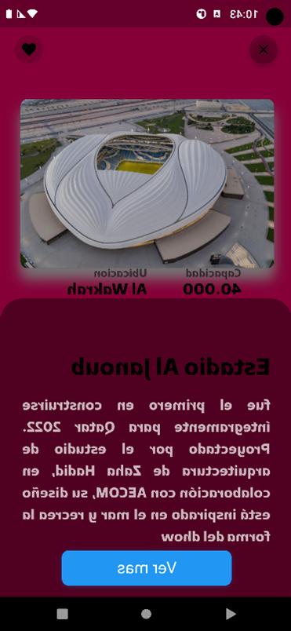 |

### Jugadores

| Detalle del Jugador |
|:---:|
| 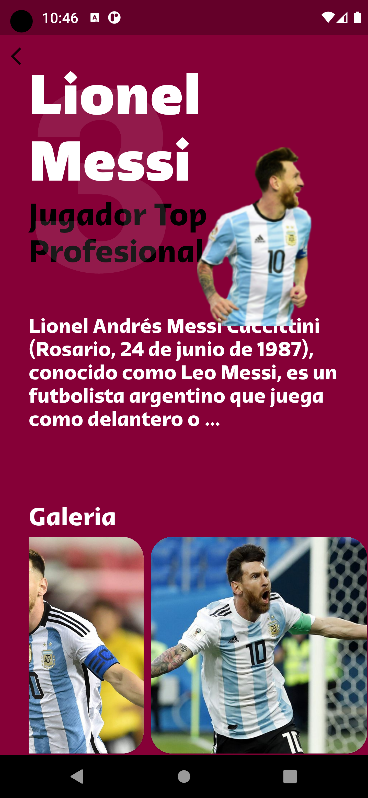 |

### Perfil

| Perfil de Usuario |
|:---:|
| 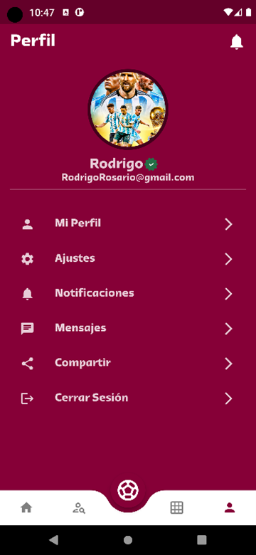 |

## 🛠️ Tecnologías

* **Framework:** Flutter 3.x
* **Lenguaje:** Dart
* **Arquitectura:** Stateful Widgets con navegación por tabs
* **Tipografía:** Qatar 2022 Arabic (fuente oficial del mundial)
* **Navegación:** `page_transition` para animaciones fluidas
* **UI Components:** `animated_bottom_navigation_bar`, `flutter_swiper_view`
* **Íconos:** `flutter_vector_icons`, Material Icons

## 📦 Dependencias Principales

```yaml
dependencies:
  flutter:
    sdk: flutter
  cupertino_icons: ^1.0.6
  animated_bottom_navigation_bar: ^1.3.3
  page_transition: ^2.0.5
  flutter_swiper_view: ^1.1.8
  flutter_vector_icons: ^2.0.0
```

## 🚀 Instalación y Ejecución

1. **Clonar el repositorio:**
```bash
git clone https://github.com/RodrigoRosario345/Aplicacion_del_Mundial_Qatar2022.git
cd Aplicacion_del_Mundial_Qatar2022
```

2. **Instalar dependencias:**
```bash
flutter pub get
```

3. **Ejecutar la aplicación:**
```bash
flutter run
```

4. **Generar APK (Android):**
```bash
flutter build apk --release
```

## 📋 Requisitos de Desarrollo

* Flutter SDK 3.4.3+
* Dart SDK >= 3.4.3
* Android Studio / VS Code
* Android SDK (para compilación Android)
* Xcode (para compilación iOS - solo macOS)

## 📁 Estructura del Proyecto

```
lib/
├── main.dart                    # Punto de entrada de la aplicación
├── constants.dart               # Constantes globales y colores
├── Jugadores.dart               # Modelo de datos de jugadores
├── models/
│   └── plants.dart              # Modelo de estadios/items
└── ui/
    ├── onboarding_screen.dart   # Pantallas de bienvenida
    ├── root_page.dart           # Navegación principal con bottom nav
    ├── scan_page.dart           # Pantalla de fixture/partidos
    └── screens/
        ├── home_page.dart       # Página principal
        ├── signin_page.dart     # Login
        ├── signup_page.dart     # Registro
        ├── forgot_password.dart # Recuperar contraseña
        ├── detail_page.dart     # Detalle de estadio
        ├── details_page.dart    # Detalle de jugador
        ├── favorite_page.dart   # Selecciones/Favoritos
        ├── cart_page.dart       # Grupos
        ├── profile_page.dart    # Perfil de usuario
        ├── FixtureScreen.dart   # Calendario de partidos
        ├── data.dart            # Datos de jugadores
        └── widgets/             # Componentes reutilizables
            ├── GrupoA.dart
            ├── GrupoB.dart
            ├── GrupoC.dart
            └── ...

assets/
├── images/          # Logos e imágenes generales
├── banderas/        # Banderas de las selecciones
├── stadiums/        # Fotos de los estadios
└── Selecciones/     # Imágenes de selecciones

fonts/
├── Qatar2022Arabic-Bold.ttf
└── Qatar2022Arabic-Heavy.ttf
```

## 🎨 Paleta de Colores

| Color | Código | Uso |
|-------|--------|-----|
| Guinda Qatar | `RGB(134, 0, 55)` | Color principal de fondo |
| Blanco | `#FFFFFF` | Textos y acentos |
| Negro | `#000000` | Textos secundarios |

## 📝 Notas

* Proyecto desarrollado de práctica en Flutter
* Los datos de jugadores, estadios y partidos son informativos del Mundial Qatar 2022

## 👨‍💻 Autor

Rodrigo Rosario Cruz
